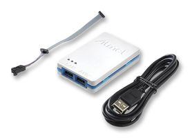

# avrisp
udev rules to use ATMEL programmers with AVRDUDE

It took me some time digging how to make ubuntu recognize ATMEL-ICE and ATMEL AVRISP mkII until I finally got [here](http://steve.kargs.net/bacnet/avr-isp-mkii-on-ubuntu-hardy/), and [here](https://stackoverflow.com/questions/5412727/avrisp-mkii-doesnt-work-with-avrdude-on-linux). I'm saving the steps here for my configurations.

## Installation
Clone this repository
```
$ git clone git@github.com:hd-faria/avrisp.git
```

Change directory to ./avrisp (assuming you are at the directory where you cloned the repository to)
```
$ cd ./avrisp 
```

To check if your is on the list, plug in the USB cable of you Atmel programmer and type in a terminal:
```
$ dmesg | grep 'idProduct'
```

The last entry should have your devices idVendor and idProduct, now verify if it's listed in avrisp.rules:
```
$ cat avrisp.rules
```

Create a symbolic link to /etc/udev/rules.d/
```
$ sudo ln ./avrisp.rules /etc/udev/rules.d/60-avrisp.rules
```

Make sure you are a member of the 'dialout' group. It should be listed when you type:
```
$ groups
```

Restart udev
```
$ sudo service udev restart
```

## Use cases
Tested using ATMEL-ICE to download the flash and EEPROM content from an at90can64 uC.


```
$ avrdude -c atmelice_isp -p c64 -P usb -U flash:r:flash.hex:i
```

```
$ avrdude -c atmelice_isp -p c64 -P usb -U eeprom:r:eepromdump.hex:i
```

